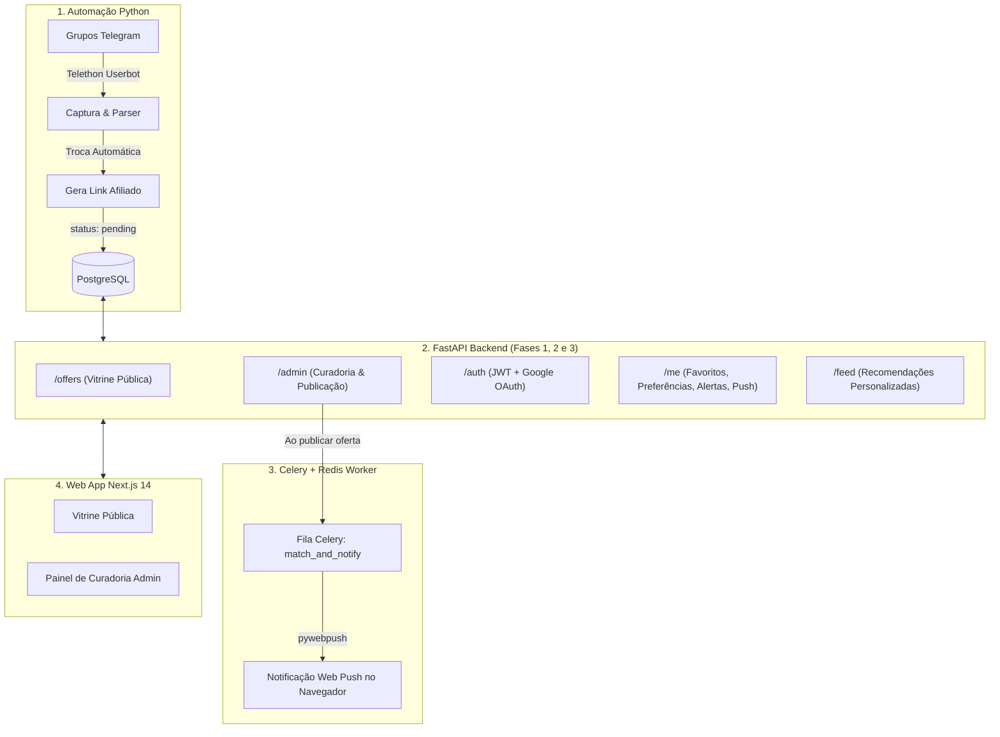

# ⚡ PromoRadar — Agregador de Promoções & Cupons

Um ecossistema completo para agregação, curadoria e recomendação de ofertas em tempo real inspirado no **Pechinchou** e **Promobit**.

- **Frontend (Fases 1 e 2)**: Next.js 14 (App Router) + TypeScript + Tailwind CSS + TanStack Query + Recharts.
- **Backend (Fases 1, 2 e 3)**: FastAPI + PostgreSQL + SQLAlchemy + Alembic + Celery + Redis + Web Push (pywebpush) + JWT & Google OAuth.

---

## 🏛️ Arquitetura das 3 Fases



---

## 🚀 Novas Funcionalidades da Fase 3 (Backend FastAPI)

1. **Autenticação Segura & Google OAuth**:
   - Cadastro e Login com e-mail/senha criptografados com `bcrypt`.
   - Login social Google via validação segura de `id_token` (`google-auth`).
   - Sessão com access token curto (30 min) + refresh token (30 dias).
   - Dependência `get_current_user` para proteção de rotas.
   - Proteção contra brute force via rate limiting por IP.

2. **Preferências do Usuário (`/me/preferences`)**:
   - Definição de categorias favoritas (ex: eletrônicos, games).
   - Definição de lojas favoritas (ex: Amazon, Kabum, Mercado Livre).
   - Desconto mínimo padrão personalizado.

3. **Favoritos (`/me/favorites`)**:
   - Salvar ofertas favoritas para consulta rápida.
   - Prevenção de duplicidade com chave única (`user_id + offer_id`) retornando `409 Conflict`.
   - Exclusão e listagem completa com dados do produto.

4. **Alertas de Preço Inteligentes (`/me/alerts`)**:
   - Criação de alertas flexíveis: por categoria, loja e/ou palavra-chave no título (ex: "RTX 4060", "Air Fryer", "iPhone 15").
   - Disparo condicional baseado no desconto alvo mínimo (`discount_pct >= target_discount`).

5. **Notificações Web Push em Tempo Real (Celery + Redis + pywebpush)**:
   - Registro de inscrições Push do navegador com chaves VAPID (`p256dh` e `auth`).
   - Celery Task assíncrona `match_and_notify`: ao publicar uma oferta, cruza instantaneamente com os alertas ativos.
   - Envio de notificação rica com imagem do produto, percentual de desconto e link direto.
   - Deduplicação: o mesmo usuário nunca recebe notificações repetidas para a mesma oferta.
   - Auto-limpeza de inscrições canceladas (`410 Gone`).

6. **Feed Personalizado (`/feed`)**:
   - Algoritmo de ranqueamento que prioriza ofertas das categorias e lojas preferidas do usuário com desconto acima do mínimo, completando com ofertas populares como fallback.

---

## 📂 Estrutura do Backend FastAPI

```
├── requirements.txt                  # Dependências Python
├── alembic.ini                       # Configurações de migração
├── api/
│   ├── main.py                       # Instância FastAPI, CORS, rate limiting e rotas
│   ├── deps.py                       # Injeção de dependências (get_db, get_current_user)
│   ├── security.py                   # Hash bcrypt, JWT e Google ID Token
│   ├── routes/
│   │   ├── auth.py                   # /auth/register, /auth/login, /auth/google, /auth/refresh, /me
│   │   ├── preferences.py            # GET /me/preferences, PATCH /me/preferences
│   │   ├── favorites.py              # GET, POST, DELETE /me/favorites
│   │   ├── alerts.py                 # GET, POST, DELETE /me/alerts
│   │   ├── push.py                   # POST, DELETE /me/push/subscribe
│   │   └── feed.py                   # GET /feed (ranqueamento personalizado)
│   └── schemas/
│       ├── user.py                   # Schemas Pydantic v2 de auth e usuário
│       ├── preference.py             # Schemas de preferências
│       ├── favorite.py               # Schemas de favoritos
│       ├── alert.py                  # Schemas de alertas
│       ├── push.py                   # Schemas de Web Push
│       └── feed.py                   # Schemas do feed
├── processor/
│   ├── celery_app.py                 # Instância Celery com broker Redis
│   └── notify.py                     # Task match_and_notify + pywebpush
├── database/
│   ├── connection.py                 # Engine SQLAlchemy e gerador get_db
│   ├── models.py                     # Modelos SQLAlchemy (Users, Preferences, Favorites, Alerts, Push, Offers)
│   └── migrations/
│       ├── env.py                    # Runner do Alembic
│       └── versions/
│           └── 20260912_phase3_user_layer.py # Migração criando tabelas da Fase 3
└── tests/
    ├── conftest.py                   # Fixtures de banco SQLite em memória
    ├── test_auth.py                  # Testes de registro, login e JWT
    ├── test_favorites.py             # Testes de favoritos e conflito 409
    └── test_alerts_matching.py       # Testes da lógica de matching de alertas
```

---

## ⚙️ Guia de Execução do Backend

### 1. Criar e Ativar Ambiente Virtual
```bash
python -m venv venv
# No Windows:
venv\Scripts\activate
# No Linux/Mac:
source venv/bin/activate
```

### 2. Instalar Dependências
```bash
pip install -r requirements.txt
```

### 3. Gerar Chaves VAPID para Web Push
Você pode gerar o par de chaves públicas/privadas pelo terminal:
```bash
# Opção A: via pywebpush
pip install pywebpush
vapid --gen

# Opção B: via npx
npx web-push generate-vapid-keys
```
Insira as chaves geradas no seu arquivo `.env` em `VAPID_PUBLIC_KEY` e `VAPID_PRIVATE_KEY`.

### 4. Executar Migrações do Banco de Dados
```bash
alembic upgrade head
```

### 5. Iniciar o Servidor FastAPI
```bash
uvicorn api.main:app --reload --port 8000
```
Documentação interativa disponível em: **http://localhost:8000/docs**

### 6. Iniciar o Worker Celery (para envio assíncrono de notificações)
```bash
# Certifique-se de que o Redis está rodando (porta 6379)
celery -A processor.celery_app worker --loglevel=info
```

### 7. Executar a Suíte de Testes
```bash
pytest tests/ -v
```

---

## 🌐 Resumo de Endpoints da API

| Método | Rota | Autenticado? | Descrição |
|---|---|---|---|
| `POST` | `/auth/register` | Não | Cadastro com e-mail, senha e nome |
| `POST` | `/auth/login` | Não | Login com emissão de access e refresh token |
| `POST` | `/auth/google` | Não | Login social via Google `id_token` |
| `POST` | `/auth/refresh` | Não | Renovação de access token |
| `GET` | `/me` | Sim | Perfil do usuário atual |
| `GET` | `/me/preferences` | Sim | Consulta de preferências (categorias, lojas, desconto min) |
| `PATCH` | `/me/preferences` | Sim | Atualização das preferências |
| `GET` | `/me/favorites` | Sim | Listagem de produtos favoritados (com join) |
| `POST` | `/me/favorites` | Sim | Adiciona oferta aos favoritos |
| `DELETE`| `/me/favorites/{id}`| Sim | Remove oferta dos favoritos |
| `GET` | `/me/alerts` | Sim | Lista alertas de preço ativos/inativos |
| `POST` | `/me/alerts` | Sim | Cria alerta por categoria, loja, palavra-chave e % OFF |
| `DELETE`| `/me/alerts/{id}` | Sim | Remove alerta de preço |
| `POST` | `/me/push/subscribe` | Sim | Registra inscrição Web Push do navegador |
| `DELETE`| `/me/push/subscribe` | Sim | Cancela inscrição Web Push |
| `GET` | `/feed` | Sim | Feed personalizado baseado nas preferências |
| `GET` | `/offers` | Não | Vitrine pública com filtros e paginação |
| `POST` | `/admin/offers/{id}/publish` | Sim | Publica oferta e dispara Celery `match_and_notify` |
